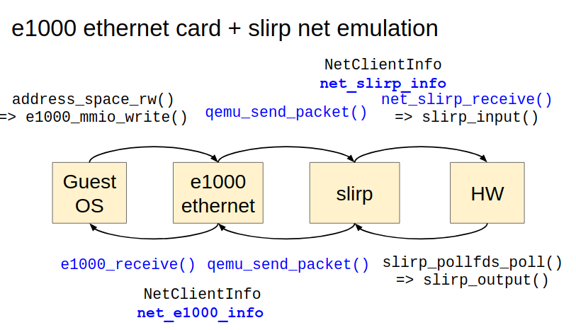

QEMU Network
============

introduction(architecture)
--------------------------

virtual network device 跟 network emulation 的程式碼會各實作出一個 ``NetClientState``, 然後兩者互相 peering.
當兩者要傳出資料給對方時, 都會呼叫 ``qemu_send_packet*()`` 相關的 API 來完成.

``qemu_send_packet*()`` 則會呼叫 peer 的 ``NetClientState`` 之中的 ``NetClientInfo->receive*()`` 相關 API 來接收對方給的資料.

所以每套 virtual network device 跟 network emulation 都需要提供 ``NetClientInfo`` 的介面, 

- virtual network device 的 ``NetClientInfo->receive*()`` 實作 QEMU 如何把資料傳回 guest OS driver.
- network emulation 的 ``NetClientInfo->receive*()`` 實作 QEMU 如何把資料透過 host OS 的 APIs 送出到 remote OS.

舉例來說, 以下是一個 guest OS sending packet 的範例, 使用 e1000-slirp 的網路設定.
sending packets 的 control flow (QEMU part)::

    VM Exit => address_space_rw() 
    => e1000_mmio_write() => start_xmit() => ... => e1000_send_packet() 
    => qemu_send_packet() 
    => net_slirp_receive() => slirp_input() => ip_input() => tcp_input() ... => send() syscall
    
第一行是 QEMU 接受 guest 的 MMIO exit 並轉交給 e1000 網卡 emulation 的邏輯, 這邊不詳述.
第二行是 e1000 程式碼的實作, 可以發現 e1000 最後透過 ``qemu_send_packet*()`` 送出封包給 network emulation 的部份做模擬.
第四行則轉接到 slirp 所提供的 ``NetClientInfo->receive()`` API, 可以看到 API 開始透過 slirp 的 tcp/ip stack 來 decapsulate 封包, 最後把資料透過 system call :ref:`[1] <slirp_input>` 送出.

以下是架構參考圖:

p.s.

-  關於 ``qemu_send_packet()`` 如何呼叫 ``NetClientInfo->receive()``, 請參考 :ref:`qemu_send_packet`

.. _qemu_send_packet:

qemu_send_packet() 跟 NetClientInfo
-----------------------------------

basic struct
~~~~~~~~~~~~
overview::

  - struct NetClientState
   
    - NetClientInfo* info
    - NetClientState* peer
    - NetQueue *incoming_queue
  
    - QTAILQ_ENTRY(NetClientState) next
  
``NetQueue`` methods::

  - methods
  
    - qemu_net_queue_append(): 從 parameter 把要 sending 的資料暫存到 queue->packets
    - qemu_net_queue_flush(): 把所有 queue->packets 的資料都進行 qemu_net_queue_deliver()
    - qemu_net_queue_deliver(): 呼叫該 NetQueue 的 deliver method: queue->deliver()
    - qemu_net_queue_send(): 進行 qemu_net_queue_deliver + flush, 如果 deliver 失敗則改成 append

  - member

    - QTAILQ_HEAD(packets, NetPacket) packets
    - NetQueueDeliverFunc *deliver

``qemu_send_packet()`` calls peer ``NetClientInfo``'s receive functions

::

  qemu_send_packet(NetClientState* nc) 
  
  // => qemu_net_queue_send(nc->peer->imcoming_queue)
  => nc->peer->incoming_queue->deliver(nc, ..., nc->peer->incoming_queue->opaque) = qemu_deliver_packet_iov()
     
     // peer = nc->peer->incoming_queue->opaque ??
     [1.] peer->info->receive_iov(peer, iov, iovcnt);
     [2.] nc_sendv_compat(peer, iov, iovcnt, flags);
  
          [a.] peer->info->receive()
          [b.] peer->info->receive_raw()

